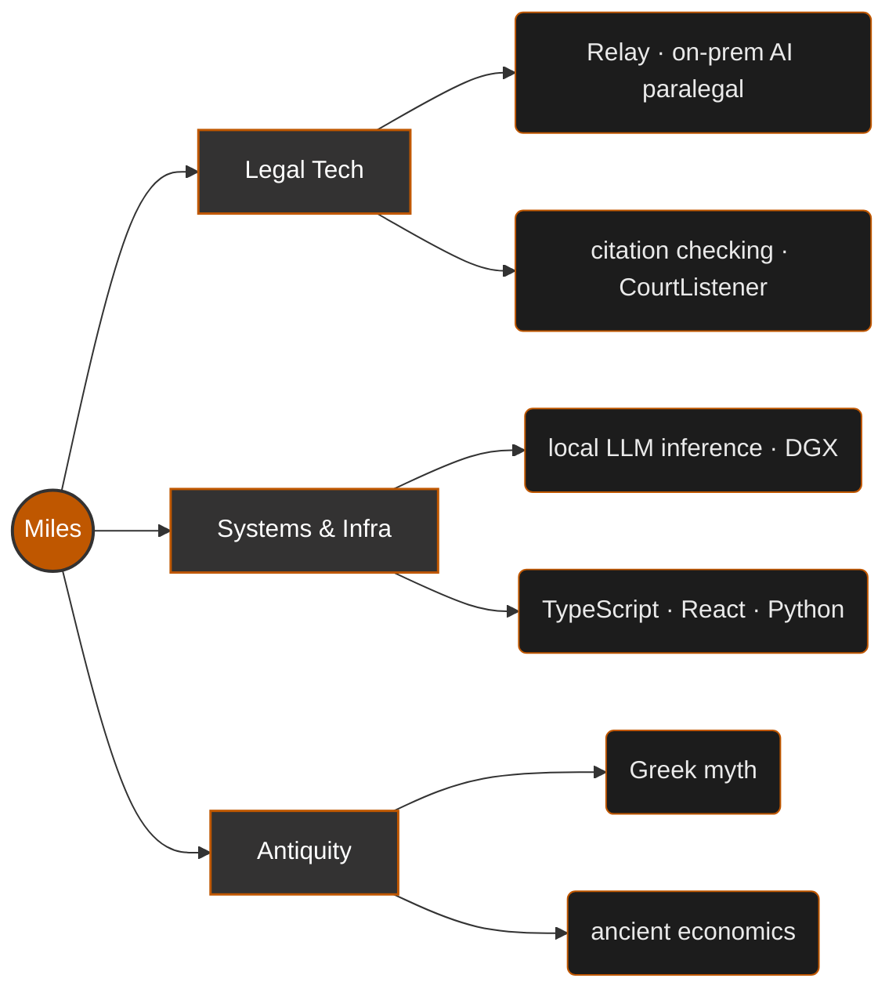

<!-- ============================================================= -->
<!--  PROFILE README                                               -->
<!--  Replace every "Miles Fritzmather" below with your GitHub username      -->
<!--  if your handle is different (appears in the stat-card URLs). -->
<!-- ============================================================= -->

<!-- Animated header -->

 

<em>Festina lente — make haste, slowly.</em>

---

### ⚖️ ⟶ 🏛️  whoami

I'm **Miles** — a sophomore studying Computer Science at UT Austin who builds at the seam between **legal technology**, **systems & infrastructure**, and an abiding curiosity for **the ancient world**. I like software that earns trust: careful, on-premises, and built to keep data exactly where it belongs.

When I'm not shipping, I'm probably reading about Greek myth or the economics of antiquity — the oldest problems and the newest tooling, same desk.

---

### 🔨 Currently forging

- **[Relay](https://relay-law.com)** — a privacy-focused AI paralegal for small law firms and solo practitioners. On-prem inference, **zero data egress**, citation checking as the core. The legal AI that never phones home.
- **[Longhorn Developers](https://github.com/Longhorn-Developers)** — leading software across 11+ teams and 100+ builders as SWE Lead.
- **Geosciences research @ UT** — data management & frontend for the School of Geosciences. Turning messy field data into things people can actually use.

---

### 🧰 The arsenal

**Languages**

**Frontend**

**Infra & tools**

---

### 🗺️ A map of the workshop

---

### 📊 By the numbers

 

<!-- Laurels 🏆 -->

---

χαλεπὰ τὰ καλά — <em>good things are hard.</em>

